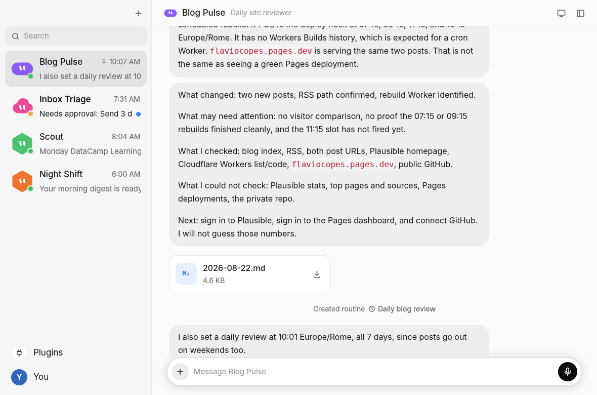
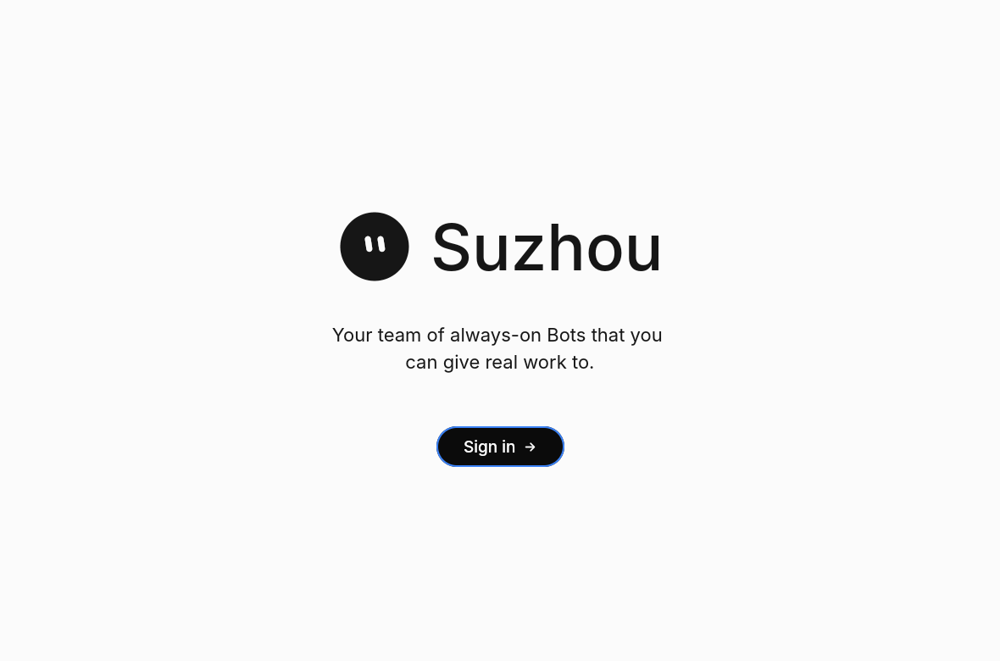
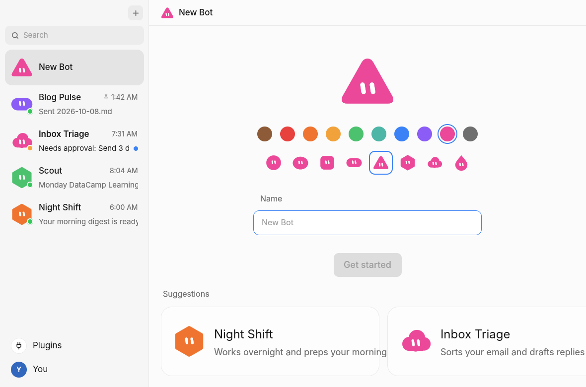
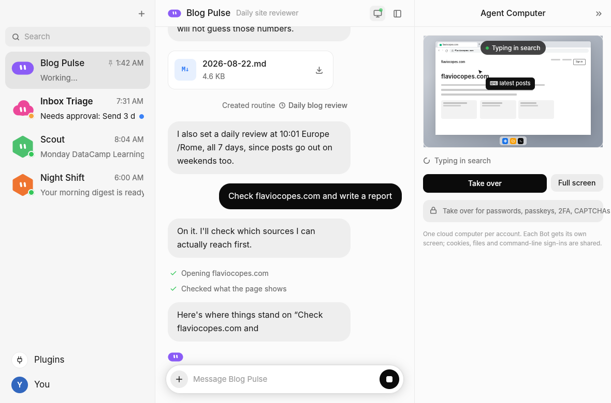
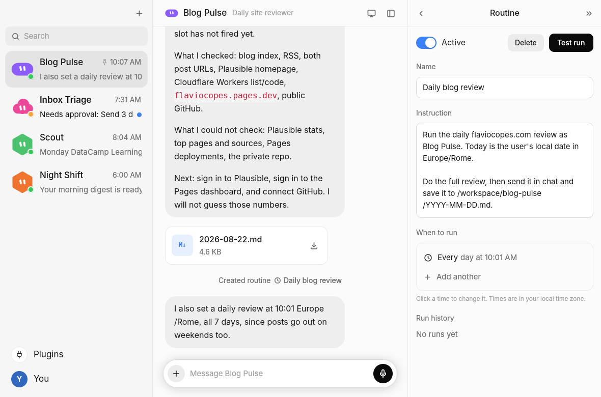
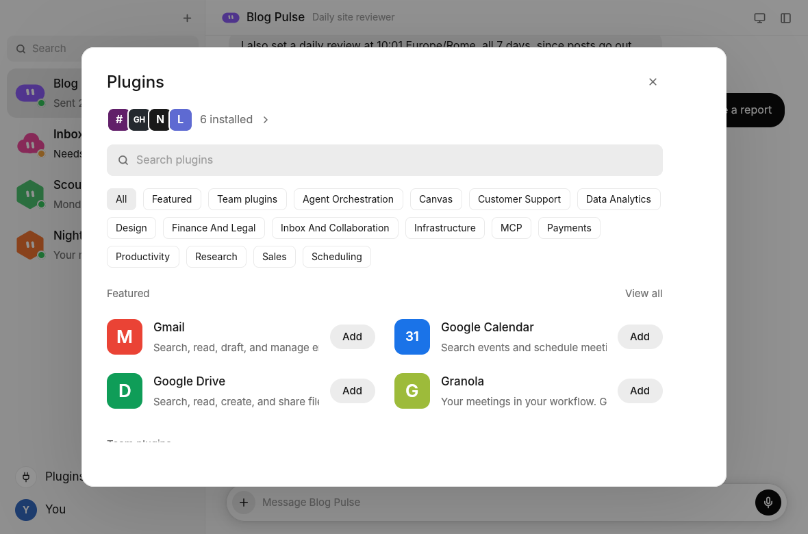
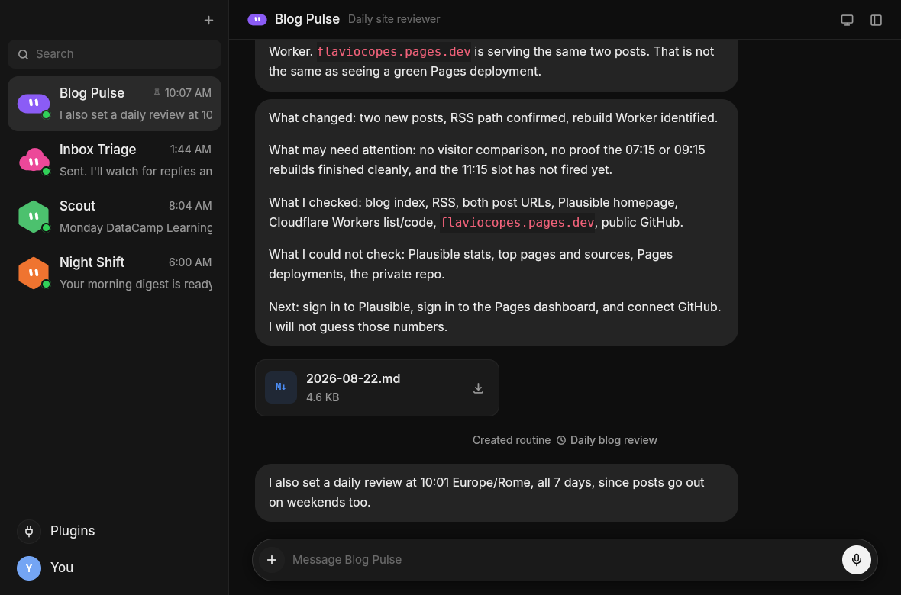

# Suzhou

A desktop app for a team of always-on Bots, written in Rust with
[GPUI](https://www.gpui.rs) (the UI framework behind the Zed editor).

Its look and flow are rebuilt from the Grok Bot desktop app: a roster of Bots
on the left, one conversation in the middle, and a panel on the right for a
Bot's details, its routines, or its Agent Computer. The work itself is done by
a pluggable backend. Today that is a built-in demo Bot or
[Pi](https://pi.dev) in RPC mode.



| Sign in | New Bot | Agent Computer |
|---|---|---|
|  |  |  |
| **Routine** | **Plugins** | **Dark** |
|  |  |  |

## Run it

```sh
# Linux needs GPUI's system libraries (Debian/Ubuntu names):
sudo apt install libxkbcommon-dev libxkbcommon-x11-dev libwayland-dev \
  libx11-xcb-dev libvulkan-dev libasound2-dev libfontconfig-dev libfreetype-dev

cargo run --release            # first run: sign-in and onboarding
cargo run --release -- --demo  # skip onboarding, start with a sample team
cargo run --release -- --reset # forget everything and start again
```

macOS works too (Xcode command line tools). The app needs a GPU driver with
Vulkan on Linux or Metal on macOS.

## What works

Every screen below is interactive. With the demo backend, replies, tool steps,
questions and approvals are simulated so you can try the whole flow.

| Area | What you can do |
|---|---|
| **First run** | Sign in, wait for the browser, pick the apps you use, watch the computer set up, meet your first Bot. |
| **New Bot** | Pick one of 10 colours and 8 shapes, name it, or start from a suggestion (Night Shift, Inbox Triage, ...). |
| **Roster** | Search, pin, duplicate, hide and delete Bots (right-click). Status dots: green idle, orange needs you, a hopping face while working. Unread dot. |
| **Chat** | Streaming replies with links and `code`, tool steps with spinners, file cards (open or download), question cards you answer inline, approval cards (Approve / Deny), reactions, reply-to, copy, delete, "Save the process as skill". |
| **Composer** | Grows to 9 lines, Enter sends, Shift+Enter new line. `@` for Bots, routines and connectors; `/` for skills. `+` menu: attach files, Teach a task, Agent Computer, voice. Voice input with a live waveform. Stop button while a Bot works. |
| **Agent Computer** | Side panel preview with the pointer gliding to what the Bot is doing; full-screen takeover ("You're in control"), then Hand back. |
| **Details** | Profile (name, job title, description, colour, shape), routines, skills, files, pin/duplicate/hide/delete. |
| **Routines** | Active switch, Delete, Test run, name, instruction, schedules (click to change, Add another), run history. |
| **Plugins** | Search, 17 categories, Featured and Team sections, Add with a connecting state. |
| **Settings** | Appearance (System/Light/Dark), notifications, approval rules, computer Recover/Reset, sign out. |
| **Notifications** | Cards slide in when a Bot you are not looking at finishes, asks, or needs approval. Click to jump there. |

Your team is saved to `~/.local/share/suzhou/state.json` (change with
`SUZHOU_DATA_DIR`). `--demo` never writes it.

### Keyboard

`Ctrl` on Linux, `Cmd` on macOS.

| Keys | Does |
|---|---|
| Ctrl+N | New Bot |
| Ctrl+K | Search Bots |
| Ctrl+D | Start / finish voice input |
| Ctrl+I | Bot details |
| Ctrl+Shift+C | Agent Computer |
| Ctrl+Shift+P | Plugins |
| Ctrl+, | Settings |
| Ctrl+\\ | Hide / show the sidebar |
| Ctrl+Shift+L | Light / dark |
| Ctrl+. | Stop the Bot |
| Esc | Close whatever is on top |

## Motion

Animations are part of the design, not decoration:

- Messages fade and rise in; your own slide in from the right.
- The chat follows new text smoothly while a reply streams, and stops
  following when you scroll up (a button takes you back down).
- Panels slide in from the right and back out from wherever they are.
- Dialogs fade up over a dimmed window; menus drop in from where you clicked.
- The New Bot face springs when you change its colour or shape.
- Switches slide with a small overshoot. Faces blink now and then and hop
  while their Bot works.

Two tools do this. GPUI's `with_animation` plays one-shot and looping effects.
`src/anim.rs` has a small `Tween` for things that must reverse mid-way
(panels, dialogs, toasts, the computer pointer).

## Connecting Pi

```sh
npm install -g @mariozechner/pi-coding-agent   # gives you `pi`
SUZHOU_BACKEND=pi cargo run --release
```

Each Bot gets its own `pi --mode rpc` process, started on its first message,
working in its own folder (`~/.local/share/suzhou/bots/<id>/`). Its first
message is prefixed with who the Bot is (name, job, description).

| Setting | Meaning |
|---|---|
| `SUZHOU_PI_BIN` | The Pi executable (default `pi`) |
| `SUZHOU_PI_ARGS` | Extra arguments, for example `--provider anthropic --model ...` |

How Pi's events map onto the interface (`src/backend/pi.rs`):

| Pi event | Shown as |
|---|---|
| `agent_start` / `agent_end` | Bot is working / done |
| `message_update` with `text_delta` | Streaming reply |
| `tool_execution_start` / `_end` | Step with spinner, then a tick |
| `extension_ui_request` `confirm` | Approval card; your answer is sent back |
| `extension_ui_request` `input` / `select` | Question card; your answer is sent back |
| `response` with `success: false` | Grey error line |

**Caveat:** this mapping was written from Pi's RPC documentation, without a
live Pi to test against. Unknown events are ignored, so a mismatch shows up as
a quiet UI rather than a crash. Expect small fixes when you first connect it.

### Adding another backend

Implement `backend::Backend` (`send` a `Request`), push `Event`s into the
channel, and add it to `backend::connect`. The UI never talks to anything
else.

## Code map

| Path | Holds |
|---|---|
| `src/main.rs` | Window, fonts, command-line flags |
| `src/ui/app.rs` | All state and behaviour; backend events land here |
| `src/ui/sidebar.rs`, `chat.rs`, `new_bot.rs`, `panels.rs`, `modals.rs`, `overlays.rs`, `onboarding.rs` | One file per area of the screen |
| `src/ui/computer.rs` | The Agent Computer screen drawing |
| `src/ui/text_input.rs` | Multi-line text field (GPUI has none built in) |
| `src/ui/rich.rs` | Markdown-ish text: lists, headings, links, `code` |
| `src/backend/` | `mock.rs` demo Bot, `pi.rs` Pi adapter |
| `assets/` | Icons, avatar shapes, fonts (embedded at build time) |

## Not done yet

- Sign-in is simulated; there is no account server.
- The Agent Computer is a drawing driven by backend events, not a real remote
  screen. A real one needs a VNC/WebRTC stream from wherever the Bot runs.
- Voice input shows the recording UI and inserts sample text; no speech
  recognition yet.
- Plugins are a catalogue; "Add" does not run OAuth.
- Bot groups, mobile layout and Teach-a-task screen recording are not built.

## Licence

MIT. Bundled fonts keep their own licences (Inter: OFL 1.1; DejaVu Sans Mono).
