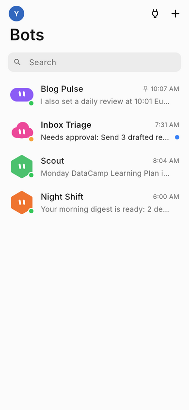
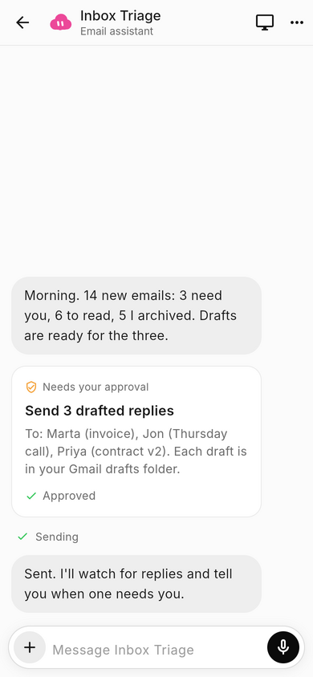
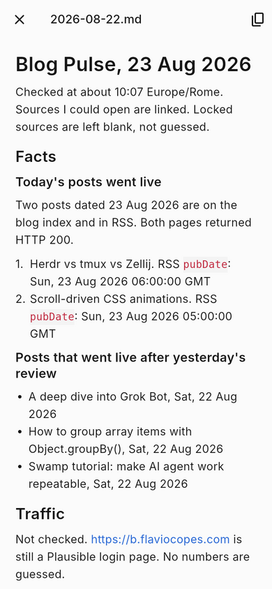
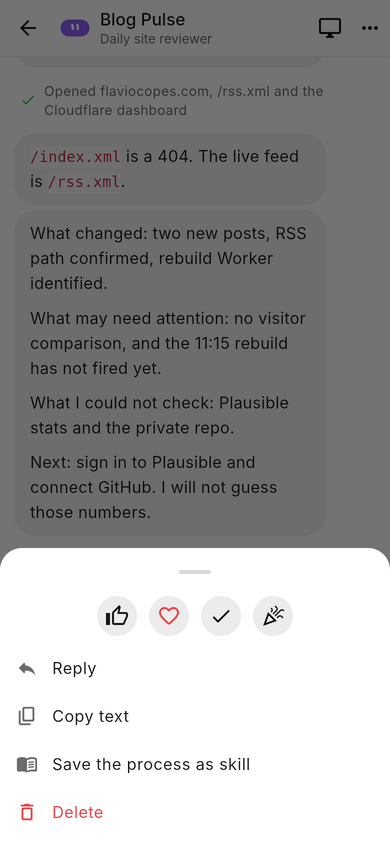
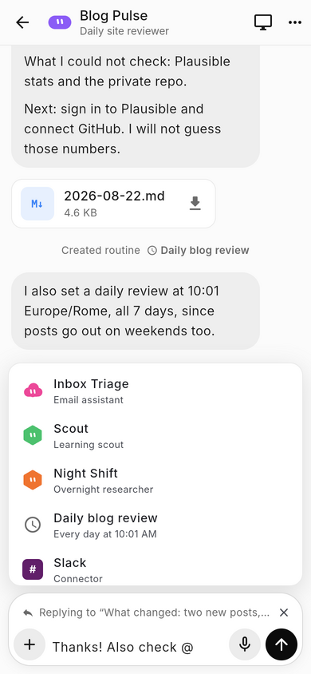
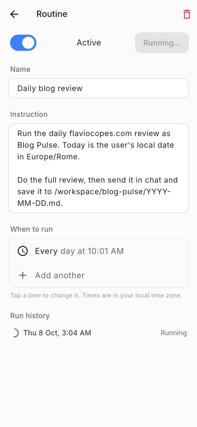
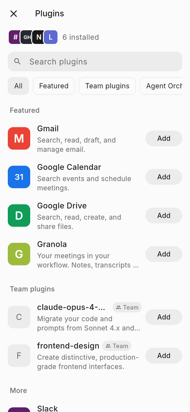
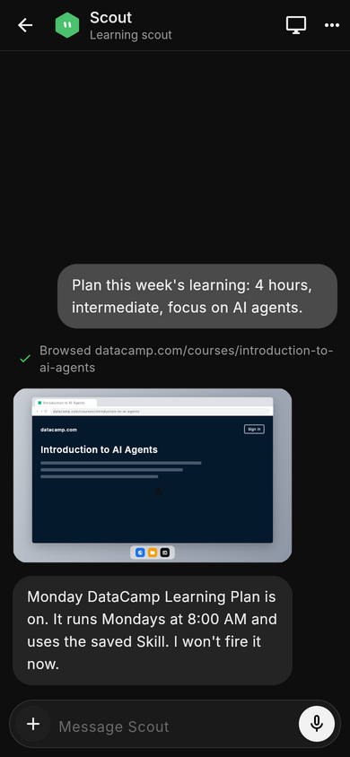

# Suzhou for phones (Flutter)

The mobile version of Suzhou: your team of always-on Bots, on iOS and
Android. It mirrors the desktop app in the repository root (Rust + GPUI)
screen for screen, laid out for one hand: a list of Bots, a full-screen chat,
and pages and bottom sheets instead of side panels.

| Bots | Approval | Report | Message actions |
|---|---|---|---|
|  |  |  |  |
| **@ mention** | **Routine** | **Plugins** | **Dark** |
|  |  |  |  |

## Run it

You need [Flutter](https://docs.flutter.dev/get-started/install) 3.47 or newer.

```sh
cd mobile
flutter pub get
flutter run                          # first run: sign-in and onboarding
flutter run --dart-define=DEMO=true  # start with a sample team
```

For a phone you also need Android Studio (Android) or Xcode on a Mac (iOS).
To try it in a browser instead: `flutter run -d chrome`, and add `?demo` to
the address for the sample team.

## What works

The same features as the desktop app, adapted to touch:

| Area | On the phone |
|---|---|
| **First run** | Sign in, browser wait, pick your apps, computer setup, "Meet a future teammate". |
| **Bots** | Large-title list, search, pinned first, status dots, a hopping face while working, unread dot. Long-press for Edit profile, Pin, Duplicate, Hide, Delete. |
| **New Bot** | 10 colours and 8 shapes (they fit one row on small phones), name, suggestions. The face springs when you change it. |
| **Chat** | Streaming replies, tool steps, file cards (open, copy), questions answered inline, Approve / Deny cards, Agent Computer snapshots. Long-press a message: react, reply, copy, save as skill, delete. |
| **Composer** | Grows to 6 lines. `@` for Bots, routines and apps; `/` for skills. `+` opens a sheet: Choose File, Take Photo, Attach Image, Teach a task, Agent Computer. Voice input with a live waveform. Stop while the Bot works. |
| **Agent Computer** | Live preview with the pointer gliding to what the Bot does. Take over goes full screen (tap to click, pinch to zoom), then Hand back. |
| **Details / Routines** | Profile editor, routines (on/off, Test run, schedules, run history), skills, files. |
| **Plugins / Settings** | Search, categories, Add with a connecting state. Light / dark / system, notifications, approval rules, backend. |
| **Notifications** | Cards drop in from the top when a Bot you aren't viewing finishes, asks or needs approval; tap to jump there, swipe up to dismiss. |

Motion: Hero faces from the list into the chat, messages fading and rising in,
iOS-style page slides, bottom sheets, springy reactions and avatar picker,
blinking and hopping faces, animated status and buttons.

Your team is saved on the device (`shared_preferences`). The demo team is
never saved.

## Connecting Pi

A phone can't run the `pi` command, so a small bridge runs next to Pi on a
computer and relays Pi's RPC protocol over a WebSocket:

```sh
# On the computer with Pi installed:
cd mobile
dart run tool/pi_bridge.dart --port 8787 -- --provider anthropic   # extra args go to pi
```

Then in the app: **Settings > Backend**, enter `ws://<computer's address>:8787`.
Each Bot gets its own `pi --mode rpc` process and folder, the same as the
desktop app.

Two warnings:

- The bridge has **no authentication**. Only run it on a network you trust,
  or behind a tunnel that adds sign-in (Tailscale, Cloudflare Tunnel, ...).
- The Pi message mapping (`lib/backend/pi_backend.dart`) was written from
  Pi's RPC docs and tested with hand-written sample messages, not against a live Pi.
  Unknown messages are ignored, so a mismatch shows up as a quiet UI rather
  than a crash.

## Code map

| Path | Holds |
|---|---|
| `lib/main.dart` | App, theme switch, notification cards |
| `lib/state.dart` | All state and behaviour; backend events land here |
| `lib/screens/` | One file per screen |
| `lib/widgets/` | Faces (drawn in code), buttons, rich text, the computer drawing |
| `lib/backend/` | Demo Bot and the Pi adapter |
| `tool/pi_bridge.dart` | The Pi relay |
| `test/` | Logic tests and two full walk-through widget tests |

```sh
flutter analyze && flutter test
```

## Not done yet

- Sign-in is simulated. Attachments, photos and voice are simulated too (no
  file picker, camera or speech recognition yet).
- The Agent Computer is a drawing driven by Bot events, not a live screen.
- Not yet built or tested on a real phone: Android and iOS project files are
  generated, but this branch was only run and tested in Chrome at phone size.
